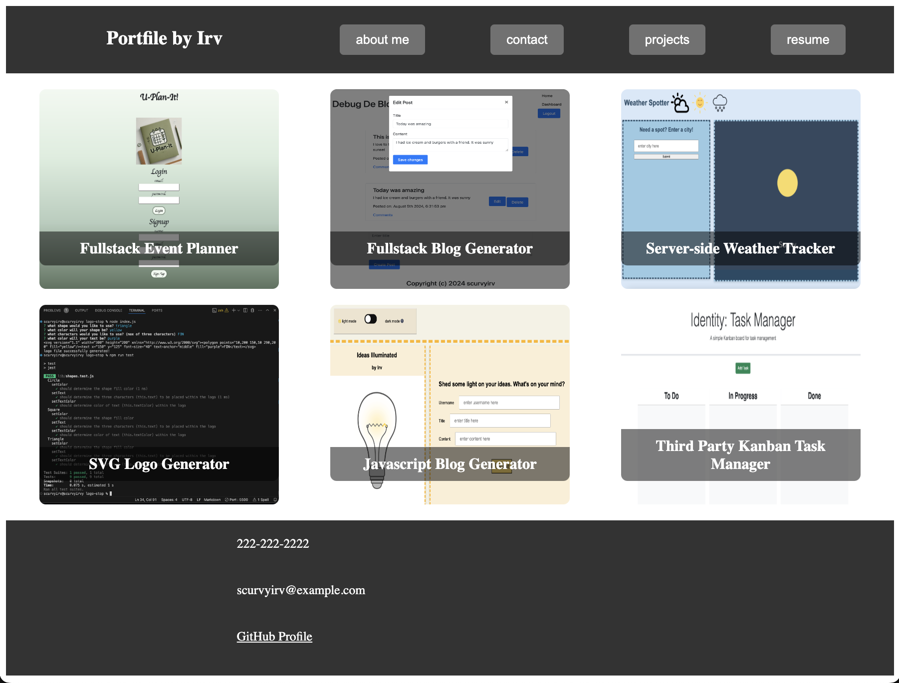

# Portfile

## Description

Portfile is a single-page application that uses React to display user biography, skillset, and contact information. Centralize your files through one port with Portfile!

## Table of Contents

- public
  - images
- src
  - components
    - Content
      - Content.css
      - Content.jsx
    - Footer
      - Footer.css
      - Footer.jsx
    - Header
      - Header.css
      - Header.jsx
  - pages
    - AboutMe
      - AboutMe.css
      - AboutMe.jsx
    - Contact
      - Contact.css
      - Contact.jsx
    - Projects
      - Projects.css
      - Projects.jsx
    - Resume
      - Resume.css
      - Resume.jsx
  - App.css
  - App.jsx
  - main.jsx
- gitignore
- eslint.config.js
- index.html
- LICENSE
- package.json
- readme.md
- vite.config.js

## Tasks

- WHEN I complete installation and seeding, THEN I can run the server and view the default page as 'About Me'
- WHEN I hover over the navigation bar, THEN I see responsive buttons that take me to the respective view
- WHEN I click 'contact' on the nav bar, THEN I am contents of the middle of the page change to a form
- WHEN I enter information on the contact page, THEN I am alerted when incomplete fields are left or when invalid emails are provided; otherwise, I am notified that message is sent
- WHEN I click 'projects' on the nav bar, THEN I see the middle section populated with projects that are responsive upon hover
- WHEN I click a project, THEN I am directed to the project page on click
- WHEN I click 'resume' on the nav bar, THEN I see the middle section populated with the web developer's skill set and an option to download their resume
- WHEN I click on the responsive links on the nav bar, THEN I see the URL change with respect to the content that renders

## Usage

Here is quick look at the projects component of this application.

## Links

- Deployed Webpage: (NEED) pending
- GitHub Repo Page: https://github.com/scurvyirv/portfile

## Credits

- React: https://www.npmjs.com/package/react
- Vite: https://www.npmjs.com/package/vite
- React Router: https://www.npmjs.com/package/react-router-dom
- ES Lint: https://www.npmjs.com/package/eslint

## License

MIT License

Copyright (c) 2024 scurvyirv

Permission is hereby granted, free of charge, to any person obtaining a copy of this software and associated documentation files (the "Software"), to deal in the Software without restriction, including without limitation the rights to use, copy, modify, merge, publish, distribute, sublicense, and/or sell copies of the Software, and to permit persons to whom the Software is furnished to do so, subject to the following conditions:

The above copyright notice and this permission notice shall be included in all copies or substantial portions of the Software.

THE SOFTWARE IS PROVIDED "AS IS", WITHOUT WARRANTY OF ANY KIND, EXPRESS OR IMPLIED, INCLUDING BUT NOT LIMITED TO THE WARRANTIES OF MERCHANTABILITY, FITNESS FOR A PARTICULAR PURPOSE AND NONINFRINGEMENT. IN NO EVENT SHALL THE AUTHORS OR COPYRIGHT HOLDERS BE LIABLE FOR ANY CLAIM, DAMAGES OR OTHER LIABILITY, WHETHER IN AN ACTION OF CONTRACT, TORT OR OTHERWISE, ARISING FROM, OUT OF OR IN CONNECTION WITH THE SOFTWARE OR THE USE OR OTHER DEALINGS IN THE SOFTWARE.
